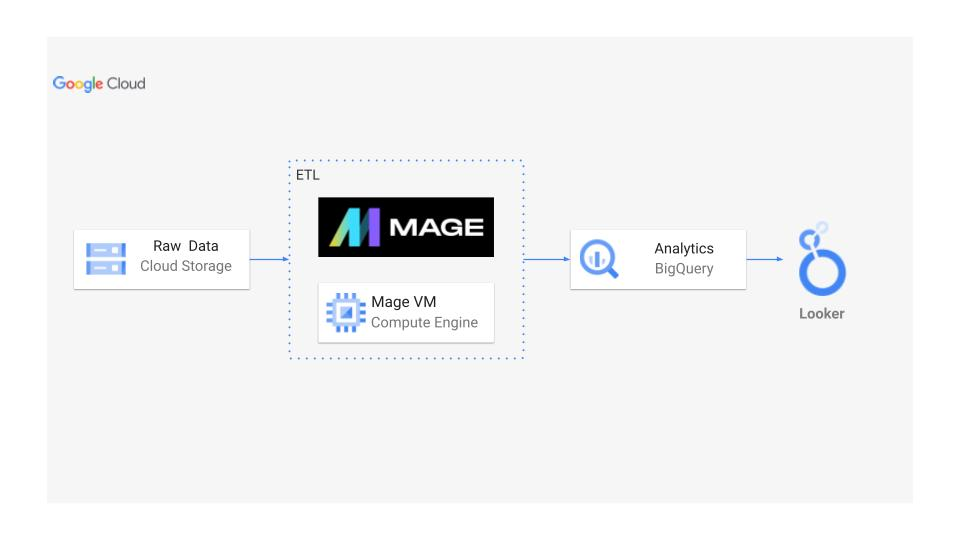
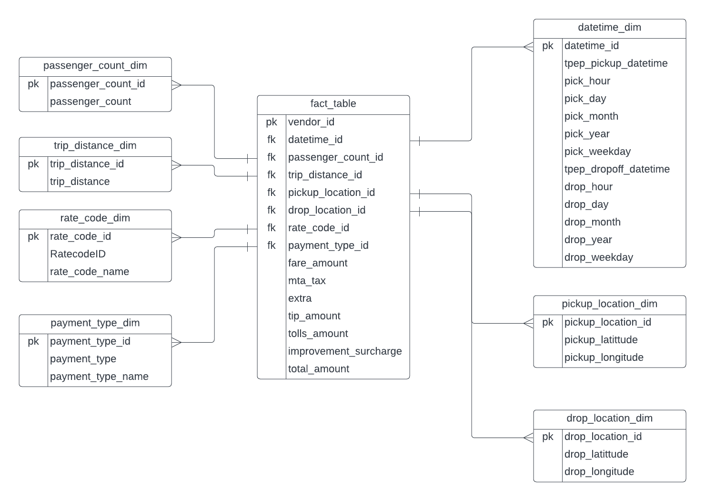

# Data Analysis of Taxi data

The analysis of TLC trip record data for yellow and green taxis is the main goal of this research. Important details in the dataset include pick-up and drop-off dates and times, locations, trip distances, prices, rate types, payment methods, and passenger counts. Making educated judgements about transport networks is the aim of this project, which aims to extract significant insights from the data, identify patterns, trends, and linkages.

This project's goals include performing exploratory data analysis (EDA) to comprehend the structure of the dataset, spot any problems with the data's quality, and learn more about variable distributions. In order to manage the fleet and allocate resources as efficiently as possible, a time-based study will also be carried out to determine the peak times, days, or months of taxi utilisation. In order to increase the availability of taxis and the efficiency of route planning, spatial analysis will also be used to look at the distribution of pick-up and drop-off sites geographically. This will help to discover popular regions, traffic patterns, and demand hotspots.

To further understand pricing dynamics and client preferences, fare analysis will be conducted to look into tariff structures, rate types, and payment methods. This analysis will examine the effect of payment alternatives on customer satisfaction and optimise pricing structures. Last but not least, passenger analysis will concentrate on researching reported passenger counts to pinpoint typical group sizes, evaluate their influence on trip length or charge, and comprehend the demand for various taxi sizes.

By attaining these goals, this project hopes to improve the quality of the taxi services, increase operational effectiveness, and contribute to the formulation of transportation and urban planning policy. It is crucial to remember that the precise aims and objectives may be modified depending on the data at hand, the preferences of stakeholders, and the circumstances of the project.

## Dataset Used
  
TLC Trip Record Data Yellow and green taxi trip records include fields capturing pick-up and drop-off dates/times, pick-up and drop-off locations, trip distances, itemized fares, rate types, payment types, and driver-reported passenger counts.

Data also available in this repository under data folder.

Website - https://www.nyc.gov/site/tlc/about/tlc-trip-record-data.page

Data Dictionary - https://www.nyc.gov/assets/tlc/downloads/pdf/data_dictionary_trip_records_yellow.pdf

## Workflow 

## Architecture of the Database

## Technology Used

Programming Language - Python

Google Cloud Platform

- Google Storage
- Compute Instance
- BigQuery
- Looker Studio
    
Modern Data Pipeine Tool - https://www.mage.ai/

Contibute to this open source project - https://github.com/mage-ai/mage-ai

## DashBoard Link

https://lookerstudio.google.com/reporting/e25ecec4-b479-4c09-b594-d6f6b2a668ec

